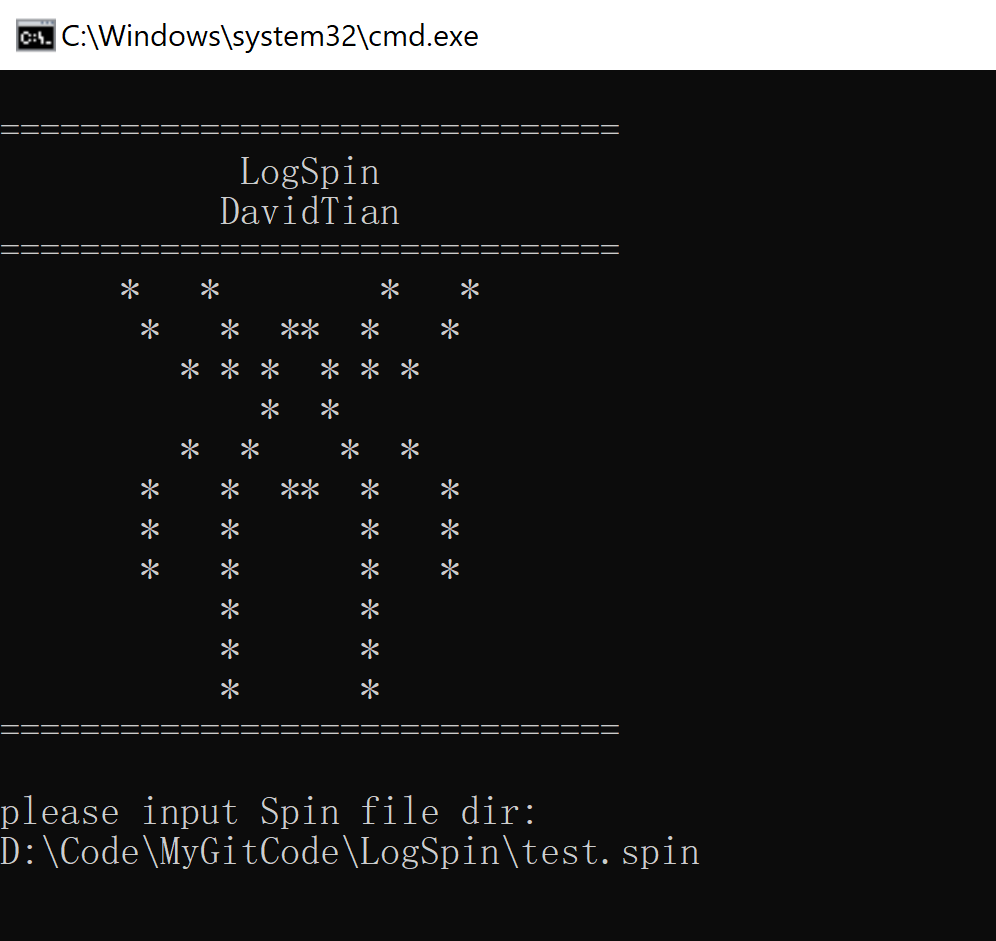
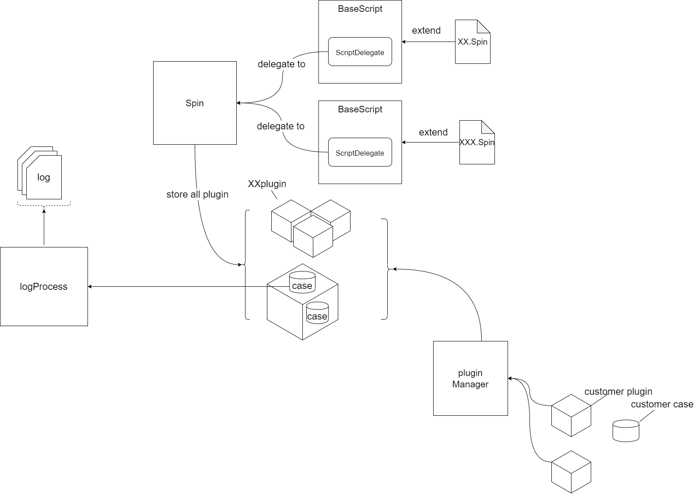

# LogSpin  

LogSpin is for user to custom the way to get information for log. You can customize the spin file to adapt to different scenarios, and you can extend its functionality by customizing plugins. LogSpin offers a flexible model that can support the different usage requirements for anyone.
- [LogSpin](#logspin)
  - [Get Start](#get-start)
    - [Quick Use](#quick-use)
    - [Base Element](#base-element)
    - [Spin file](#spin-file)
    - [how to apply the plugin](#how-to-apply-the-plugin)
    - [how to write plugin](#how-to-write-plugin)
    - [how to export the plugin](#how-to-export-the-plugin)
  - [framework](#framework)
  
## Get Start
### Quick Use
First Create the Spin file. The example Spin file will be introduced later.
 
  For tool user:
  
   First to download the Spin-tool.zip, Unzip and then click Run.bat, fill the log path to Spin, and select the Spin file.  
   
   
  For code user:
  
   First to add dependency
   ~~~
   repositories {
         maven{
             url = "http://172.16.212.70:8081/nexus/content/repositories/snapshots/"
         }
         ...
     }
   dependencies {
    ...
    implementation 'org.xtian.logspin:launch:1.1-SNAPSHOT'
  }
   ~~~
  Then to create a main function like:
  ~~~
  import org.logSpin.launch.LauncherHelper;
  
  public class Main {
      public static void main(String[] args) {
          LauncherHelper launcherHelper = new LauncherHelper();
          launcherHelper.run(args);
      }
  }
  ~~~
  And then you can run main with spin file path as args.
### Base Element
   *Info* :
   > To get the message not changed in the hole log file.
  
   *Rule* :
   > To get the message is not change during one log scope(like the android org.logSpin.annotation.plugin support process scope), and this element work with "When" and "Then".
    
   *When* :
   > Set the condition keyword for check 
   *Then* :
   > Set the condition result
   
   *Flow* :
   > To get the message will change during the one log scope, and this kind key word can make a flow of work.
### Spin file
   First apply the plugin you need , the default BasePlugin already apply by default
~~~
apply "AndroidPlugin" //Apply Plugin

...
// Android org.logSpin.annotation.plugin support
android{
   process "com.xx.xx.xxx", "com.xx.xx.xxx"
}
~~~
   Set the log path to Spin system
~~~
logSet{
   logPath = ["xx","xx"] //log path
}
~~~
   Some examples of basic elements , which are supported in BasePlugin.  
~~~
info {
   name1 {
     key = "xx"
     description "this is key"
   }
   name2 {
     key = "xx"
     description "this is another key"
   }
}
~~~
~~~
rule {
  when "condition1","condition2","condition3" then "print result"
}

def name2 = {
   when "condition1","condition2"
}

def name3 = {
   when "condition1","condition2"
}

when name2, name3 then "print result"- [LogSpin](#logspin)
~~~
~~~
flow {
  name4 {
   key "xx"
  }

  name5 {
   key "xx","xx"
  }
}
~~~
### how to apply the plugin
 For code user:
 
 First add dependency.
 ~~~
   repositories {
         maven{
             url = "http://172.16.212.70:8081/nexus/content/repositories/snapshots/"
         }
         ...
     }
   dependencies {
    ...
    //use NavigationPlugin for exampe
    implementation 'org.example:NavigationPlugin:1.0-SNAPSHOT'
  }
 ~~~
 then follow the run by code.

  For jar user:
  
  Download the plugin jar, and put it to the folder ExternalPlugin folder under root path,
  Spin system can will load the plugin under that folder.
  Then you can apply this plugin in spin file:
  ~~~
   apply "XXXPlugin"
   ...
  ~~~
### how to write plugin
 First set up the code run environment as above. 
 And add annotation dependency:
 ~~~
dependencies {
    ...
    //This for spin system to understand which is plugin
    annotationProcessor 'org.xtian.logspin:annotation:1.1-SNAPSHOT'
}
 ~~~
Then create Plugin:
~~~
// you need annotation the plugin as @org.logSpin.annotation.Plugin
@org.logSpin.annotation.Plugin
public class NavigationPlugin implements Plugin<Spin> {

   ...
    @Override
    public void resolveCase(Spin spin) {
     // this part will be invoke when the Spin is finish configuration
    }

    @Override
    public void apply(Spin spin) {
        //this part is init
       ...
    }

    public void function(Closure closure) {
        closure.run();
        //This part is for plugin user to Customized
    }

   ...
}
~~~
So you can add function closure to Spin file:
~~~
 apply "NavigationPlugin"
 ...
 function{
   .....
 }
 ...
~~~
### how to export the plugin
First add the plugin name and class name to the manifest.
~~~
jar {
    manifest {
        attributes 'Plugin-Class': 'xx.xx.pluginClassName'
        attributes 'Plugin-Name': 'pluginName'
    }
}
~~~
Then publish it to maven, for other people to use.
## framework

## code structure
